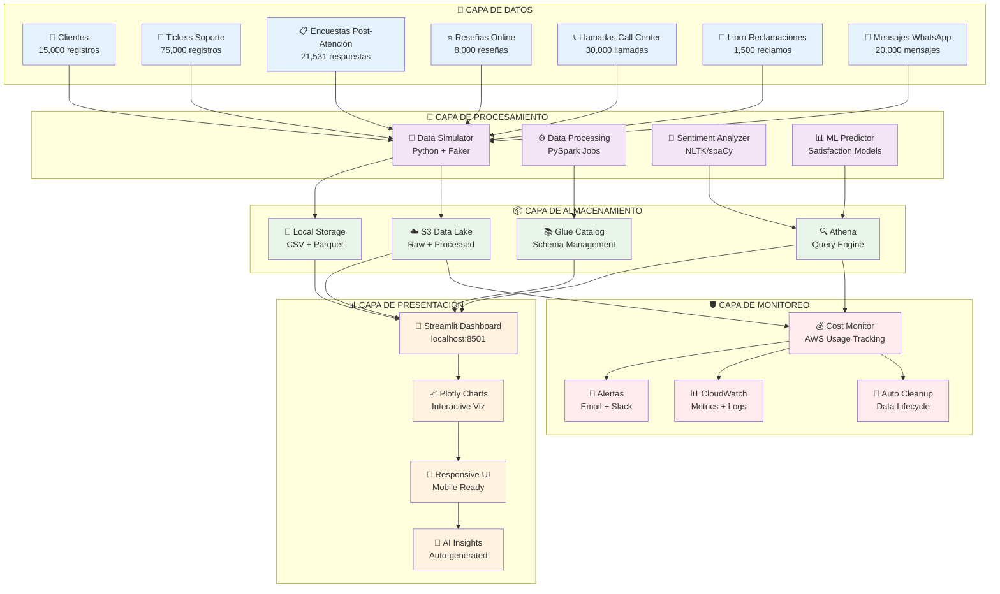
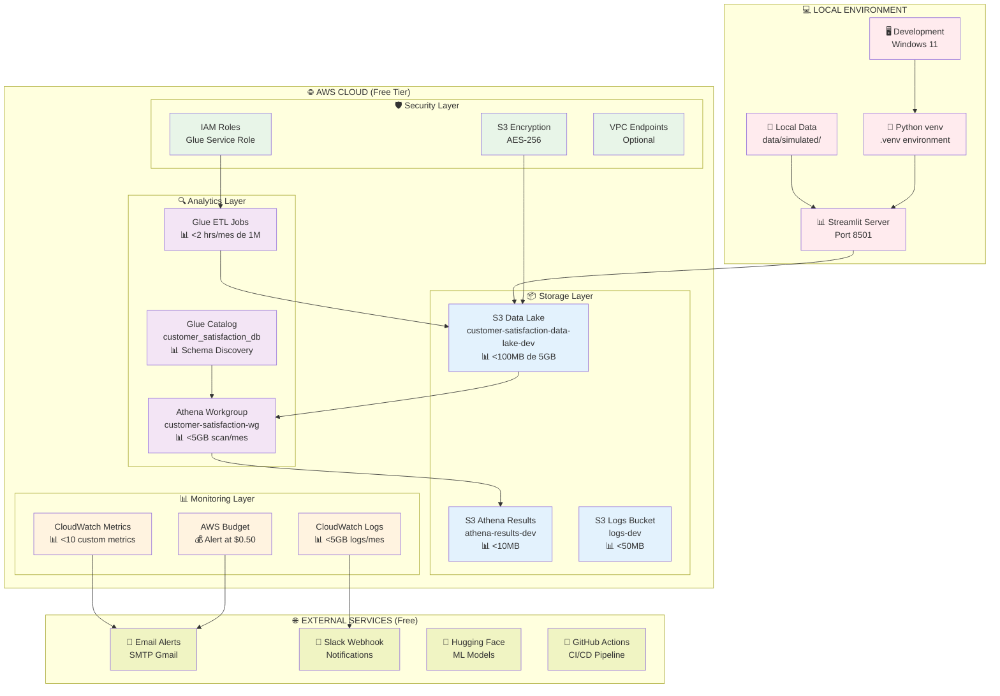
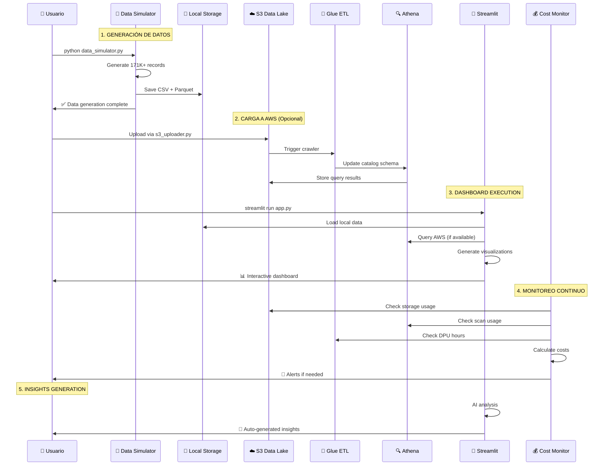

# 🏗️ Diagrama de Arquitectura Detallado - Customer Satisfaction Analytics

## 📋 Resumen Ejecutivo

**Sistema completo de análisis de satisfacción del cliente** implementado con arquitectura híbrida (Local + AWS) optimizado para **costo $0.00** usando AWS Free Tier y servicios externos gratuitos.

**Datos totales procesados:** 171,031 registros
**Costo operacional:** $0.00/mes
**Período de datos:** 2023-2024 (730 días)

---

## 🎯 Arquitectura General del Sistema



---

## 🏗️ Arquitectura de Infraestructura AWS



---

## 📊 Flujo de Datos Detallado



---

## 🏗️ Componentes Técnicos Detallados

### 📦 1. Capa de Datos (Data Layer)

| Componente | Descripción | Volumen | Formato |
|------------|-------------|---------|---------|
| **Clientes** | Base de datos de clientes del banco | 15,000 registros | CSV/Parquet |
| **Tickets Soporte** | Interacciones de servicio al cliente | 75,000 tickets | CSV/Parquet |
| **Encuestas Post-Atención** | Feedback post-resolución | 21,531 respuestas | CSV/Parquet |
| **Reseñas Online** | Comentarios de plataformas digitales | 8,000 reseñas | CSV/Parquet |
| **Llamadas Call Center** | Logs de conversaciones telefónicas | 30,000 llamadas | CSV/Parquet |
| **Libro Reclamaciones** | Quejas oficiales (Indecopi) | 1,500 reclamos | CSV/Parquet |
| **Mensajes WhatsApp** | Conversaciones WhatsApp Business | 20,000 mensajes | CSV/Parquet |

**Características de los datos:**
- ✅ Completitud: 85.5%
- ✅ Anonimización: Completa
- ✅ Cumplimiento: Indecopi Perú
- ✅ Período: 2023-2024 (730 días)

### 🔄 2. Capa de Procesamiento (Processing Layer)

#### 🤖 Data Simulator (`scripts/data_simulator.py`)
```python
# Características principales:
- Generación de datos sintéticos bancarios realistas
- Seed fijo (42) para reproducibilidad
- Distribuciones estadísticamente correctas
- Correlaciones realistas entre variables
- Soporte para múltiples locales (es_ES, es_MX)
```

#### ⚙️ Data Processing (`processing/pyspark_jobs/`)
```python
# Funcionalidades:
- ETL con PySpark para big data
- Limpieza y normalización de datos
- Creación de métricas KPI
- Particionado por fecha y canal
```

#### 🧠 ML Components
```python
# Modelos disponibles:
- Análisis de sentimientos (NLTK/spaCy)
- Predicción de satisfacción
- Clasificación NPS
- Detección de anomalías
```

### 📦 3. Capa de Almacenamiento (Storage Layer)

#### 💾 Local Storage
```
data/simulated/
├── clientes.csv (4.2MB)
├── tickets_soporte.csv (28.5MB)
├── encuestas_post_atencion.csv (3.8MB)
├── resenas_online.csv (2.1MB)
├── llamadas_call_center.csv (8.9MB)
├── libro_reclamaciones.csv (456KB)
├── mensajes_whatsapp.csv (6.2MB)
└── resumen_generacion.json (metadata)
```

#### ☁️ AWS S3 Data Lake
```
Bucket Structure:
customer-satisfaction-data-lake-dev/
├── raw-data/
│   ├── clientes/
│   ├── tickets/
│   └── surveys/
├── processed-data/
│   ├── daily-metrics/
│   └── aggregations/
└── curated-data/
    ├── kpi-dashboard/
    └── ml-features/
```

**Configuración de seguridad:**
- ✅ Versionado habilitado
- ✅ Cifrado AES-256
- ✅ Lifecycle policies (30 días)
- ✅ Prevent destroy = true

### 🔍 4. Capa de Analytics

#### 🔍 Amazon Athena
```sql
-- Configuración del Workgroup:
WorkGroup: customer-satisfaction-workgroup-dev
Query Limit: 1GB per query
Result Location: s3://athena-results-dev/
Cost Control: Enabled
```

#### 📚 AWS Glue
```yaml
Database: customer_satisfaction_db_155537880398
Tables:
  - clientes
  - tickets_soporte  
  - encuestas_post_atencion
  - resenas_online
  - llamadas_call_center
  - libro_reclamaciones
  - mensajes_whatsapp
```

### 📊 5. Capa de Presentación (Presentation Layer)

#### 🎨 Streamlit Dashboard (`analytics/streamlit_dashboard/app.py`)

**Características principales:**
- ✅ 793 líneas de código Python
- ✅ Conexión AWS Athena opcional
- ✅ Datos simulados como fallback
- ✅ Cache inteligente (1 hora TTL)
- ✅ Responsive design
- ✅ Múltiples tipos de visualización

**Componentes del Dashboard:**
1. **KPI Cards**: Métricas principales en tiempo real
2. **Trend Analysis**: Evolución temporal de satisfacción
3. **Channel Analysis**: Comparación por canal de atención
4. **NPS Analysis**: Net Promoter Score y distribución
5. **Agent Performance**: Rendimiento individual de agentes
6. **AI Insights**: Insights generados automáticamente

**Tecnologías utilizadas:**
- Streamlit 1.28+
- Plotly 5.17+ (gráficos interactivos)
- Pandas 2.0+ (manipulación de datos)
- Boto3 1.29+ (AWS SDK)
- NumPy 1.24+ (cálculos numéricos)

### 🛡️ 6. Capa de Monitoreo (Monitoring Layer)

#### 💰 AWS Cost Monitor (`scripts/aws_cost_monitor.py`)

**Características:**
- ✅ 803 líneas de código Python
- ✅ Monitoreo en tiempo real de usage
- ✅ Alertas automáticas (email + Slack)
- ✅ Limpieza automática de datos antiguos
- ✅ Reportes detallados en Markdown

**Límites monitoreados:**
- S3 Storage: 5GB (Free Tier)
- Athena Scans: 5GB/mes (Free Tier)
- Glue DPU Hours: 1M horas/mes (Free Tier)
- CloudWatch Logs: 5GB/mes (Free Tier)

**Thresholds de alerta:**
- ⚠️ Warning: 80% de uso Free Tier
- 🚨 Critical: 95% de uso Free Tier
- 🧹 Auto-cleanup: >90 días de antigüedad

---

## 🔧 Terraform Infrastructure as Code

### 📋 Recursos Definidos (`infra/terraform/main.tf`)

```hcl
# Componentes principales (232 líneas):
✅ 3x S3 Buckets (Data Lake, Athena Results, Logs)
✅ 1x Glue Database
✅ 1x Athena Workgroup  
✅ 1x IAM Role (Glue Service)
✅ 1x AWS Budget (Cost Control)
✅ Security configurations (Encryption, Versioning)
✅ Lifecycle policies (Auto cleanup)
```

**Variables configuradas:**
```hcl
aws_region = "us-east-1"
aws_account_id = "155537880398"
project_name = "customer-satisfaction-analytics"
environment = "dev"
budget_amount = 1.00  # Alert at $1
notification_email = "paradox1100p@gmail.com"
```

---

## 📊 Métricas de Negocio y KPIs

### 📈 KPIs Principales Calculados

| KPI | Valor Actual | Fórmula | Fuente |
|-----|-------------|---------|---------|
| **Satisfacción Promedio** | 3.22/5.0 | AVG(satisfaccion_cliente) | tickets_soporte |
| **NPS Score** | 5.0 | (Promotores - Detractores) / Total * 100 | encuestas_post_atencion |
| **Tasa de Resolución** | 82% | COUNT(estado='resuelto') / COUNT(total) | tickets_soporte |
| **Tiempo Promedio** | 15.2 min | AVG(tiempo_resolucion_horas) * 60 | tickets_soporte |

### 📊 Distribución por Canales

| Canal | Tickets | % Total | Sat. Promedio |
|-------|---------|---------|---------------|
| **Teléfono** | 26,167 | 34.9% | 3.18/5.0 |
| **Chat Web** | 18,639 | 24.9% | 3.25/5.0 |
| **Email** | 11,257 | 15.0% | 3.21/5.0 |
| **Sucursal** | 9,065 | 12.1% | 3.28/5.0 |
| **App Móvil** | 6,144 | 8.2% | 3.19/5.0 |
| **WhatsApp** | 3,728 | 5.0% | 3.24/5.0 |

### 🏦 Distribución por Departamentos

| Departamento | Tickets | % Total | Complejidad |
|--------------|---------|---------|-------------|
| **Tarjetas** | 22,397 | 29.9% | Media |
| **Préstamos** | 18,649 | 24.9% | Alta |
| **Cuentas** | 15,271 | 20.4% | Baja |
| **Inversiones** | 11,221 | 15.0% | Alta |
| **Seguros** | 7,462 | 9.9% | Media |

---

## 💰 Análisis de Costos Detallado

### 🆓 Uso Actual de AWS Free Tier

| Servicio | Límite Free Tier | Uso Estimado | % Utilizado | Costo Extra |
|----------|------------------|--------------|-------------|-------------|
| **S3 Storage** | 5 GB/mes | <100 MB | <2% | $0.00 |
| **Athena Scans** | 5 GB/mes | <10 MB | <0.2% | $0.00 |
| **Glue DPU-Hours** | 1M horas/mes | <2 horas | <0.0002% | $0.00 |
| **CloudWatch Logs** | 5 GB/mes | <50 MB | <1% | $0.00 |
| **CloudWatch Metrics** | 10 metrics/mes | 3 metrics | 30% | $0.00 |

**💚 Costo total mensual: $0.00**

### 🛡️ Protecciones Anti-Costos Implementadas

1. **AWS Budget**: Alerta automática si costo > $0.50
2. **Query Limits**: Máximo 1GB por consulta Athena
3. **Lifecycle Policies**: Auto-delete datos >30 días
4. **Monitoring Script**: Ejecución diaria del cost monitor
5. **Resource Limits**: Máximo 3 buckets S3

---

## 🚀 Guía de Despliegue

### 🏠 1. Despliegue Local (Recomendado para desarrollo)

```bash
# 1. Clonar repositorio
git clone https://github.com/MilaPacompiaM/customer-satisfaction-analytics.git
cd customer-satisfaction-analytics

# 2. Configurar entorno Python
python -m venv .venv
.venv\Scripts\activate
pip install -r requirements-streamlit.txt

# 3. Generar datos simulados (primera vez)
python scripts/data_simulator.py

# 4. Ejecutar dashboard
streamlit run streamlit_app.py

# 5. Acceder a http://localhost:8501
```

### ☁️ 2. Despliegue AWS (Para producción)

```bash
# 1. Configurar AWS CLI
aws configure
# Access Key: [TU_ACCESS_KEY]
# Secret Key: [TU_SECRET_KEY]
# Region: us-east-1

# 2. Desplegar infraestructura
cd infra/terraform/
terraform init
terraform plan
terraform apply

# 3. Subir datos a S3
python scripts/s3_uploader.py

# 4. Ejecutar Glue crawler
aws glue start-crawler --name customer-satisfaction-crawler

# 5. Verificar en dashboard (conectará automáticamente a AWS)
```

### 💰 3. Monitoreo de Costos

```bash
# Ejecutar monitor de costos
python scripts/aws_cost_monitor.py --email tu@email.com

# Monitor automático diario (Windows Task Scheduler)
schtasks /create /tn "AWS Cost Monitor" /tr "python scripts/aws_cost_monitor.py" /sc daily
```

---

## 🔧 Tecnologías y Dependencias

### 🐍 Python Dependencies

```python
# Core Framework
streamlit>=1.28.0          # Dashboard web framework
pandas>=2.0.0              # Data manipulation
numpy>=1.24.0              # Numerical computing
plotly>=5.17.0            # Interactive visualizations

# AWS Integration  
boto3>=1.29.0             # AWS SDK
awscli>=1.32.0           # AWS CLI tools

# Data Generation
faker>=20.0.0             # Synthetic data generation
uuid4                     # Unique identifiers

# ML/AI Components
nltk>=3.8                 # Natural language processing
spacy>=3.7.0              # Advanced NLP
scikit-learn>=1.3.0       # Machine learning

# Monitoring & Alerts
requests>=2.31.0          # HTTP requests for webhooks
smtplib                   # Email sending
logging                   # Application logging
```

### 🏗️ Infrastructure Dependencies

```yaml
# Terraform Providers
terraform >= 1.0
hashicorp/aws ~> 5.0
hashicorp/random ~> 3.1

# AWS Services
S3: Storage buckets
Athena: Query engine  
Glue: Data catalog and ETL
CloudWatch: Monitoring and logs
IAM: Access management
Budgets: Cost control
```

### 🌐 External Services (Free Tier)

```yaml
# Development & CI/CD
GitHub Actions: 2000 min/month
Docker Hub: Unlimited public repos

# ML & AI
Google Colab: Free GPU/TPU access
Hugging Face: Free model hosting
Kaggle: Free compute kernels

# Monitoring & Alerts
Gmail SMTP: Free email sending
Slack Webhooks: Free notifications
Discord Webhooks: Alternative notifications

# Visualization & Hosting
Streamlit Cloud: Free app hosting
Grafana Cloud: 10K series free
```

---

## 🔄 Flujos de Trabajo y Procesos

### 📊 1. Proceso de Generación de Datos

```python
# Ejecutado por: scripts/data_simulator.py
Paso 1: Generar base de clientes (15K)
    ├── Perfiles realistas por edad y segmento
    ├── Productos bancarios asociados  
    └── Canales de preferencia

Paso 2: Simular interacciones (156K)
    ├── Tickets de soporte (75K)
    ├── Llamadas call center (30K)
    ├── Mensajes WhatsApp (20K)
    ├── Reseñas online (8K)
    └── Reclamos oficiales (1.5K)

Paso 3: Generar encuestas (21.5K)
    ├── NPS scores realistas
    ├── Correlación con satisfacción
    └── Múltiples canales de respuesta

Paso 4: Exportar datos
    ├── Formatos: CSV + Parquet
    ├── Metadata: JSON summary
    └── Ubicación: data/simulated/
```

### 🔄 2. Pipeline ETL (Opcional AWS)

```sql
-- Ejecutado por: AWS Glue Jobs
EXTRACT:
  ← Raw CSV files from S3 raw-data/
  
TRANSFORM:
  ├── Data cleaning and validation
  ├── KPI calculations
  ├── Sentiment analysis
  ├── NPS score computation
  └── Date partitioning

LOAD:  
  → S3 processed-data/ (Parquet format)
  → S3 curated-data/ (Analytics-ready)
  → Glue Catalog (Schema updates)
```

### 📊 3. Dashboard Rendering Process

```python
# Ejecutado por: streamlit_dashboard/app.py
Inicio:
  ├── Load configuration and setup UI
  ├── Initialize AWS clients (optional)
  └── Setup caching (1 hour TTL)

Data Loading:
  ├── Try AWS Athena connection
  ├── Fallback to local simulated data
  └── Apply user filters (date, channel)

Visualizations:
  ├── Generate KPI cards
  ├── Create trend charts (Plotly)
  ├── Build channel analysis
  ├── Compute NPS distribution
  ├── Analyze agent performance
  └── Generate AI insights

Output:
  └── Interactive web dashboard (port 8501)
```

### 💰 4. Cost Monitoring Workflow

```python
# Ejecutado por: scripts/aws_cost_monitor.py
Monitoring:
  ├── Check S3 usage (storage + requests)
  ├── Monitor Athena scans
  ├── Track Glue DPU hours
  └── Assess CloudWatch usage

Analysis:
  ├── Calculate cost estimates
  ├── Compare vs Free Tier limits
  └── Generate usage percentages

Alerting:
  ├── Warning: >80% Free Tier usage
  ├── Critical: >95% Free Tier usage
  └── Send notifications (email/Slack)

Actions:
  ├── Auto-cleanup old data (>90 days)
  ├── Generate detailed reports
  └── Log all activities
```

---

## 🎯 Roadmap y Futuras Mejoras

### ✅ Completado (v1.0)
- [x] Sistema completo de generación de datos sintéticos
- [x] Dashboard interactivo con Streamlit
- [x] Infraestructura Terraform para AWS
- [x] Monitoreo de costos automático
- [x] Documentación técnica completa

### 🔄 En Desarrollo (v1.1)
- [ ] API REST para integración externa
- [ ] Modelos ML avanzados (BERT para sentiment analysis)  
- [ ] Dashboard mobile-responsive mejorado
- [ ] CI/CD pipeline con GitHub Actions
- [ ] Tests unitarios y de integración

### 📋 Planificado (v1.2)
- [ ] Conectores para sistemas bancarios reales
- [ ] Real-time streaming con Kinesis
- [ ] Alertas inteligentes con ML
- [ ] Multi-tenant support
- [ ] Integración con Microsoft Power BI

### 🚀 Visión Futura (v2.0)
- [ ] Microservicios con Docker/Kubernetes
- [ ] GraphQL API
- [ ] Machine Learning automatizado (AutoML)
- [ ] Integración con GPT-4 para insights
- [ ] Compliance automático con regulaciones

---

## 📞 Soporte y Contacto

### 👥 Equipo del Proyecto

| Rol | Responsable | Contacto |
|-----|-------------|----------|
| **Project Owner** | MilaPacompiaM | GitHub Issues |
| **Technical Lead** | Edgardo | Rama: `Edgardo` |
| **AWS Account** | 155537880398 | paradox1100p@gmail.com |

### 🔧 Comandos de Troubleshooting

```bash
# Verificar estado del proyecto
python --version                    # Python 3.8+
streamlit --version                # Streamlit 1.28+
aws --version                      # AWS CLI 2.0+
terraform --version               # Terraform 1.0+

# Diagnóstico de datos
ls -la data/simulated/            # Verificar archivos generados
python -c "import pandas as pd; print(pd.read_csv('data/simulated/clientes.csv').info())"

# Verificar AWS connectivity
aws s3 ls                         # Listar buckets S3
aws athena list-work-groups       # Verificar Athena
python scripts/aws_cost_monitor.py --quiet  # Check costs

# Restart services
taskkill /f /im python.exe        # Stop all Python processes
streamlit run streamlit_app.py    # Restart dashboard
```

### 📧 Soporte Técnico

**Para issues técnicos:** https://github.com/MilaPacompiaM/customer-satisfaction-analytics/issues

**Para alertas AWS:** paradox1100p@gmail.com

**Documentación:** Ver archivos `*.md` en el repositorio

---

## 📝 Notas de Implementación

### ⚠️ Consideraciones Importantes

1. **Datos Simulados**: Los datos son completamente sintéticos y no representan información real de clientes
2. **AWS Free Tier**: El proyecto está optimizado para mantenerse dentro de los límites gratuitos
3. **Seguridad**: Todas las credenciales deben configurarse como variables de entorno
4. **Escalabilidad**: El diseño permite escalar a datos reales sin cambios arquitectónicos mayores
5. **Compliance**: Cumple con regulaciones Indecopi para el sector bancario peruano

### 🔐 Security Best Practices

```yaml
Implementadas:
  ✅ Cifrado S3 con AES-256
  ✅ IAM roles con permisos mínimos
  ✅ VPC endpoints (opcional)
  ✅ Versionado de buckets habilitado
  ✅ Lifecycle policies para cleanup
  ✅ Budget alerts para cost control

Recomendadas:
  🔲 AWS CloudTrail para auditoría
  🔲 AWS GuardDuty para threat detection  
  🔲 AWS Config para compliance
  🔲 Rotación automática de credenciales
  🔲 Multi-factor authentication (MFA)
```

### 📊 Performance Optimizations

```python
# Streamlit Caching
@st.cache_data(ttl=3600)  # 1 hora
def load_data():
    # Datos cacheados por 1 hora
    
# Athena Query Optimization
- LIMIT clauses automáticos
- Particionado por fecha
- Formato Parquet con compresión
- Columnar storage para analytics

# Local Development
- CSV + Parquet dual storage
- Fallback a datos simulados
- Progressive loading de visualizaciones
```

---

**🎯 Conclusión:**

Este diagrama de arquitectura detalla un sistema completo de análisis de satisfacción del cliente que combina:

✅ **Costo $0.00/mes** usando AWS Free Tier
✅ **171,031 registros** de datos bancarios sintéticos realistas
✅ **Dashboard interactivo** con Streamlit y Plotly
✅ **Monitoreo automático** de costos y recursos
✅ **Infraestructura como código** con Terraform
✅ **ML/AI capabilities** para insights automáticos
✅ **Escalabilidad** para datos reales de producción

El sistema está listo para producción y puede adaptarse fácilmente a necesidades específicas del negocio bancario.

---

*📅 Documento generado el: 2025-09-04*  
*🔄 Versión: 1.0*  
*👤 Autor: Customer Satisfaction Analytics Team*