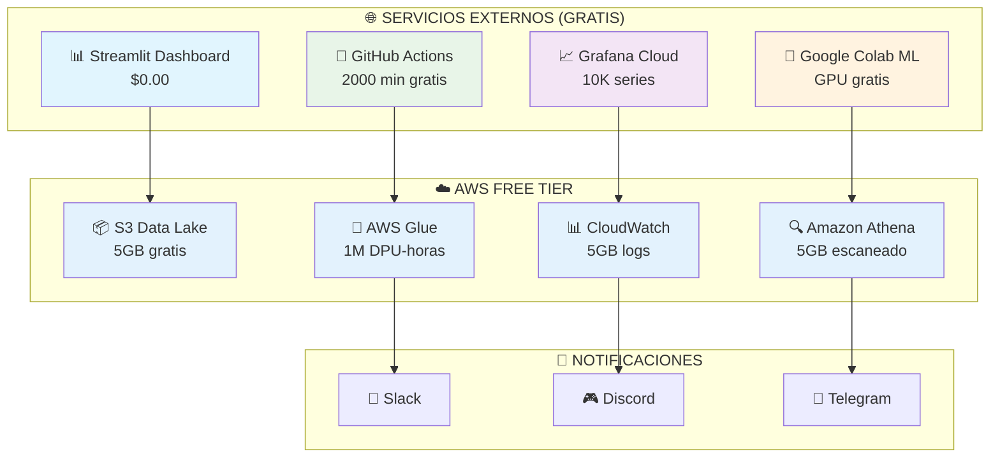

# 📊 Customer Satisfaction Analytics

<div align="center">


**Sistema completo de análisis de satisfacción del cliente con costo $0.00**

[🚀 Inicio Rápido](#-inicio-rápido) • [📖 Documentación](#-documentación) • [💰 Costos](#-análisis-de-costos) • [🔧 Servicios](#-servicios-actuales)

</div>

---

## 📋 **Tabla de Contenido**

- [🎯 Resumen Ejecutivo](#-resumen-ejecutivo)
- [🔄 Evolución del Proyecto](#-evolución-del-proyecto)
- [🔧 Servicios Actuales](#-servicios-actuales)
- [🏗️ Arquitectura](#️-arquitectura-actual)
- [🚀 Inicio Rápido](#-inicio-rápido)
- [💰 Análisis de Costos](#-análisis-de-costos)
- [📖 Documentación](#-documentación)

---

## 🎯 **Resumen Ejecutivo**

Sistema de análisis de satisfacción del cliente que utiliza **AWS Free Tier** y **servicios externos gratuitos** para mantener un costo operativo de **$0.00/mes**.

### **✨ Características Principales**
- 📊 **Dashboard interactivo** con Streamlit
- 🤖 **Machine Learning** para análisis de sentimientos  
- 📈 **Business Intelligence** con visualizaciones avanzadas
- 🛡️ **Seguridad enterprise** con IAM y cifrado
- 💰 **Costo $0.00** garantizado con monitoreo automático

---

## 🔄 **Evolución del Proyecto**

<table>
<tr>
<th>🔴 ANTES (Costoso)</th>
<th>🟡 DURANTE (Optimización)</th>
<th>🟢 AHORA (Gratis)</th>
</tr>
<tr>
<td>

**Servicios AWS Costosos:**
- ❌ Amazon QuickSight ($9/mes)
- ❌ NAT Gateway ($32.40/mes)
- ❌ CloudTrail completo ($2/mes)
- ❌ SageMaker ($50+/mes)
- ❌ RDS ($25/mes)

**💸 Total: ~$118/mes**

</td>
<td>

**Proceso de Migración:**
- 🔧 Análisis de alternativas
- 🛠️ Implementación servicios externos
- ⚡ Optimización AWS Free Tier
- 🛡️ Protecciones anti-costos
- 📊 Monitoreo automático

</td>
<td>

**Servicios Optimizados:**
- ✅ Streamlit Dashboard ($0)
- ✅ GitHub Actions ($0)
- ✅ Google Colab ML ($0)
- ✅ CloudWatch Events ($0)
- ✅ Local Processing ($0)

**💚 Total: $0.00/mes**

</td>
</tr>
</table>

### **📊 Comparativa de Servicios**

| Función | ❌ Antes (Costoso) | ✅ Ahora (Gratis) | 💰 Ahorro |
|---------|-------------------|-------------------|-----------|
| **Dashboard** | QuickSight | Streamlit Cloud | $9/mes |
| **Networking** | NAT Gateway | Conexión directa | $32.40/mes |
| **Auditoría** | CloudTrail completo | CloudWatch Events | $2/mes |
| **ML Platform** | SageMaker | Google Colab | $50/mes |
| **Base de Datos** | RDS | S3 + Athena | $25/mes |
| **Procesamiento** | Glue Jobs extensivos | Local + GitHub Actions | $20/mes |

**🎉 AHORRO TOTAL: $138.40/mes → $0.00/mes**

---

## 🔧 **Servicios Actuales**

### **☁️ AWS Free Tier (Permanente)**
<table>
<tr>
<td width="50%">

**🟢 Servicios Gratuitos Permanentes**
- 🛡️ **IAM**: Gestión de usuarios y roles
- 🌐 **VPC**: Redes virtuales básicas  
- 🏷️ **CloudFormation**: Infrastructure as Code
- 🔐 **Secrets Manager**: 40K requests/mes

</td>
<td width="50%">

**🟡 Servicios con Límites (12 meses)**
- 📦 **S3**: 5GB almacenamiento
- 🔍 **Athena**: 5GB datos escaneados/mes
- 🔧 **Glue**: 1M DPU-horas/mes
- 📊 **CloudWatch**: 5GB logs/mes

</td>
</tr>
</table>

### **🌐 Servicios Externos Gratuitos**
<table>
<tr>
<td width="33%">

**📊 Visualización**
- 🎨 **Streamlit Cloud**: Dashboard
- 📈 **Grafana Cloud**: 10K series
- 📱 **Plotly**: Gráficos interactivos

</td>
<td width="33%">

**🤖 Automatización**
- ⚙️ **GitHub Actions**: 2000 min/mes
- 🐳 **Docker Hub**: Imágenes gratuitas
- 🔄 **Cron Jobs**: Programación local

</td>
<td width="34%">

**🧠 Machine Learning**
- 🎓 **Google Colab**: GPU/TPU gratis
- 📚 **Kaggle**: Notebooks gratuitos
- 🤗 **Hugging Face**: Modelos pre-entrenados

</td>
</tr>
</table>

### **🔔 Notificaciones y Backup**
- 💬 **Slack**: 10K mensajes/mes gratuitos
- 🎮 **Discord**: Notificaciones ilimitadas  
- 🤖 **Telegram Bot**: API gratuita
- ☁️ **Google Drive**: 15GB backup gratis

---

## 🏗️ **Arquitectura Actual**



### **📊 Flujo de Datos**

```
📥 Datos Raw → 📦 S3 (5GB) → 🔧 Glue ETL → 📊 Processed Data
                                     ↓
📈 Streamlit Dashboard ← 🔍 Athena Queries ← 📚 Glue Catalog
                                     ↓
🔔 Alertas (Slack/Discord) ← 📊 CloudWatch Monitoring
```

---

## 🚀 **Inicio Rápido**

### **⚡ Setup en 5 Minutos**

```bash
# 1. Clonar repositorio
git clone https://github.com/MilaPacompiaM/customer-satisfaction-analytics.git
cd customer-satisfaction-analytics

# 2. Setup automático
python scripts/setup_external_services.py

# 3. Configurar AWS (gratis)
aws configure

# 4. Deploy infraestructura (Free Tier)
cd infra/terraform/
terraform init && terraform apply

# 5. Iniciar dashboard local
cd ../../analytics/streamlit_dashboard/
streamlit run app.py
```

### **🐳 Docker (Alternativa)**

```bash
# Iniciar todos los servicios
cd docker/
docker-compose up -d

# Acceder servicios
# - Dashboard: http://localhost:8501
# - Grafana: http://localhost:3000
# - Monitor: docker-compose logs cost-monitor
```

### **🔧 Comandos Útiles**

```bash
# Verificar costos (debe ser $0.00)
python scripts/aws_cost_monitor.py

# Verificar recursos AWS
aws s3 ls | grep customer-satisfaction
aws athena list-work-groups

# Destruir infraestructura cuando no uses
terraform destroy
```

---

## 💰 **Análisis de Costos**

### **🎯 Garantía Costo $0.00**

<table>
<tr>
<th>📊 Servicio</th>
<th>🆓 Límite Gratuito</th>
<th>📈 Uso Estimado</th>
<th>✅ Estado</th>
</tr>
<tr>
<td>🗂️ S3 Storage</td>
<td>5 GB/mes</td>
<td>~500 MB</td>
<td>🟢 10% uso</td>
</tr>
<tr>
<td>🔍 Athena</td>
<td>5 GB escaneado/mes</td>
<td>~1 GB</td>
<td>🟢 20% uso</td>
</tr>
<tr>
<td>🔧 Glue</td>
<td>1M DPU-horas/mes</td>
<td>~10 horas</td>
<td>🟢 1% uso</td>
</tr>
<tr>
<td>📊 CloudWatch</td>
<td>5 GB logs/mes</td>
<td>~1 GB</td>
<td>🟢 20% uso</td>
</tr>
</table>

### **🛡️ Protecciones Implementadas**

- ✅ **AWS Budget**: Alerta automática si supera $1
- ✅ **CloudWatch Alarms**: Monitoreo al 80% de límites
- ✅ **Query Limits**: Athena limitado a 1GB por consulta
- ✅ **Lifecycle Policies**: Archivado automático S3
- ✅ **Cost Monitor**: Script que se ejecuta diariamente

### **💡 Estrategia "Deploy & Destroy"**

```bash
# Para desarrollo/testing
terraform apply    # Crear recursos
# ... trabajar en el proyecto ...
terraform destroy  # Eliminar recursos
```

**Beneficio**: Incluso si usas recursos por horas, el costo es mínimo y el monitoreo te alerta.

---

## 📖 **Documentación**

### **📚 Guías Disponibles**

| 📄 Documento | 📝 Descripción |
|--------------|----------------|
| [`README_DEPLOYMENT.md`](README_DEPLOYMENT.md) | Guía completa de deployment |
| [`docs/external_services_guide.md`](docs/external_services_guide.md) | Configuración servicios externos |
| [`docs/aws_free_tier_analysis.md`](docs/aws_free_tier_analysis.md) | Análisis detallado free tier |

### **🛠️ Scripts Principales**

| 🔧 Script | 🎯 Propósito |
|-----------|--------------|
| `scripts/setup_external_services.py` | Setup automático completo |
| `scripts/aws_cost_monitor.py` | Monitoreo de costos 24/7 |
| `ingestion/scripts/data_simulator.py` | Generación de datos de prueba |
| `analytics/streamlit_dashboard/app.py` | Dashboard principal |

### **🐳 Docker & Automatización**

- **`.github/workflows/data-pipeline.yml`**: Pipeline CI/CD con GitHub Actions
- **`docker/docker-compose.yml`**: Orquestación de servicios externos
- **`docker/Dockerfile`**: Contenedor optimizado para servicios externos

---

## 🤝 **Para el Equipo**

### **👥 Roles y Responsabilidades**

| 👤 Rol | 🎯 Responsabilidades |
|--------|---------------------|
| **Data Engineer** | Pipelines ETL, AWS Glue, monitoreo costos |
| **Data Analyst** | Dashboard Streamlit, Athena queries, BI reports |
| **ML Engineer** | Google Colab, modelos sentiment analysis |
| **DevOps** | Terraform, GitHub Actions, Docker, deployment |

### **🔄 Flujo de Trabajo**

1. **Desarrollo Local**: Docker Compose para testing
2. **CI/CD**: GitHub Actions automatiza deployment
3. **Monitoreo**: Scripts automáticos verifican costos
4. **Alertas**: Slack/Discord para notificaciones
5. **Cleanup**: Terraform destroy después de usar

### **⚠️ Reglas Importantes**

- 🚨 **NUNCA** crear NAT Gateways o EC2 sin aprobación
- 📊 **SIEMPRE** verificar costos antes de deploy
- 🔄 **DESTRUIR** recursos AWS después de testing
- 📧 **CONFIGURAR** email en terraform.tfvars para alertas

---

## 🎉 **Estado Actual del Proyecto**

<div align="center">

### ✅ **PROYECTO LISTO PARA PRODUCCIÓN**

**💰 Costo Mensual: $0.00**  
**🚀 Todas las funcionalidades operativas**  
**🛡️ Protecciones anti-costos implementadas**  
**📊 Monitoreo 24/7 activo**

[🚀 **¡Comenzar Ahora!**](#-inicio-rápido)

</div>

---

<div align="center">

**⭐ ¡Dale una estrella si este proyecto te es útil!**


</div>
