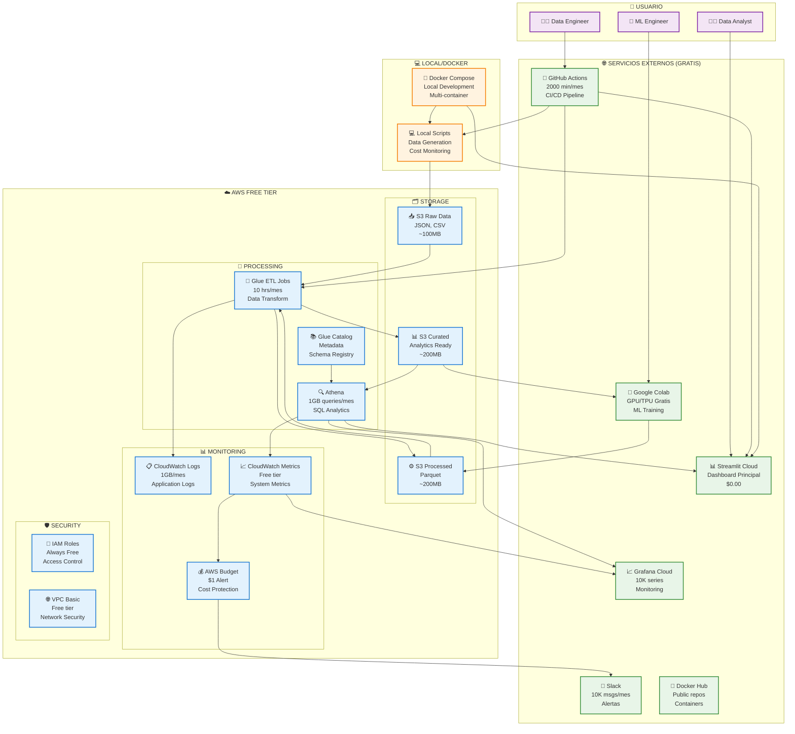
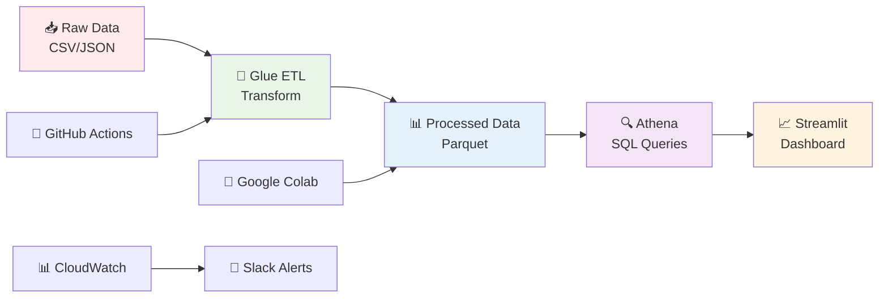
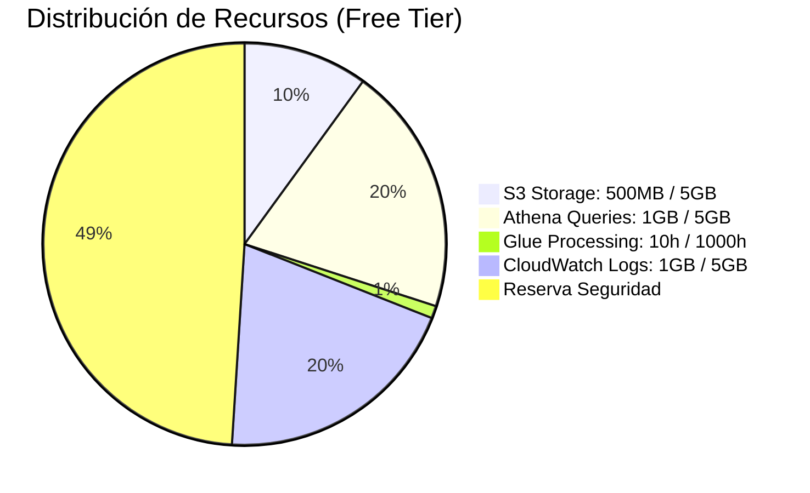
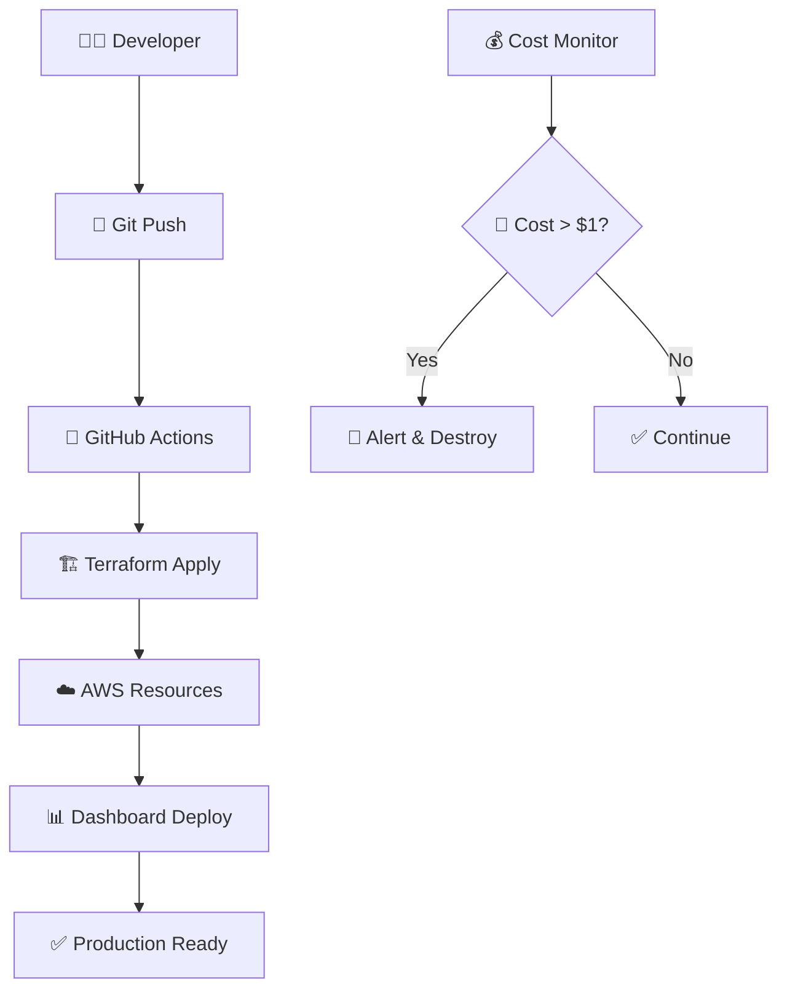
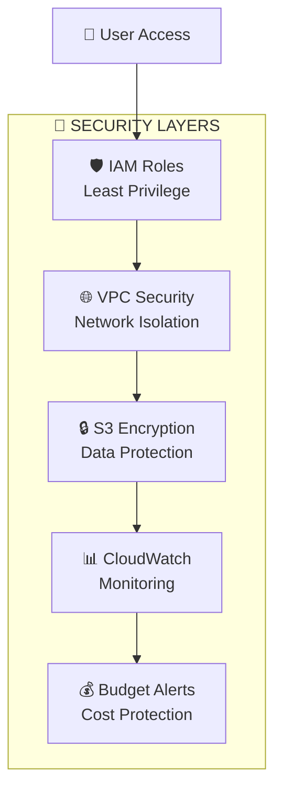

# 🏗️ **Diagramas de Arquitectura del Proyecto**

## 📊 **Opciones para Generar Diagramas**

### **🟢 Recomendadas (Gratis y Fáciles)**

1. **🎨 Draw.io (diagrams.net)**
   - **URL**: https://app.diagrams.net/
   - **Costo**: Gratis
   - **Ventajas**: Plantillas AWS, iconos oficiales, exporta PNG/SVG
   - **Uso**: Abrir navegador → Seleccionar plantilla AWS → Arrastrar componentes

2. **🔧 Lucidchart**
   - **URL**: https://lucidchart.com
   - **Costo**: Gratis (3 documentos)
   - **Ventajas**: Plantillas profesionales, colaboración en tiempo real
   - **Uso**: Crear cuenta → AWS Architecture → Drag & Drop

3. **📝 Mermaid (Código)**
   - **Integración**: GitHub, VS Code, documentación
   - **Costo**: Gratis
   - **Ventajas**: Versionado con Git, editable como código
   - **Uso**: Escribir código → Se renderiza automáticamente

---

## 🏗️ **Diagrama Mermaid (Código)**

### **Arquitectura Completa Actual**



### **Flujo de Datos Simplificado**



### **Costos y Límites**



---

## 🎨 **Draw.io Template**

### **Pasos para crear en Draw.io:**

1. **Abrir**: https://app.diagrams.net/
2. **Seleccionar**: "Create New Diagram"
3. **Plantilla**: "AWS Architecture"
4. **Componentes AWS**:
   - S3 Bucket (3 instancias: Raw, Processed, Curated)
   - AWS Glue (ETL + Catalog)
   - Amazon Athena
   - CloudWatch
   - IAM Role
   - VPC
5. **Servicios Externos**:
   - Streamlit logo
   - GitHub Actions
   - Google Colab
   - Grafana
   - Slack
6. **Conectores**: Flechas indicando flujo de datos

### **Iconos y Colores Sugeridos**

| Categoría | Color | Servicios |
|-----------|-------|-----------|
| **AWS Free** | 🔵 Azul | S3, Athena, Glue, CloudWatch |
| **Externos** | 🟢 Verde | Streamlit, GitHub, Colab |
| **Local** | 🟠 Naranja | Docker, Scripts |
| **Usuarios** | 🟣 Morado | Data Team |

---

## 📱 **Otros Diagramas Útiles**

### **🔄 Diagrama de Deployment**



### **🛡️ Diagrama de Seguridad**



---

## 🛠️ **Herramientas Adicionales**

### **📐 Para Diagramas Técnicos**
- **Cloudcraft**: https://cloudcraft.co/ (AWS específico)
- **AWS Architecture Center**: https://aws.amazon.com/architecture/
- **Creately**: https://creately.com/ (Templates AWS)

### **🎯 Para Presentaciones**
- **Canva**: Plantillas de arquitectura
- **PowerPoint**: SmartArt + iconos AWS
- **Google Slides**: Diagramas colaborativos

---

## 📄 **Exportar Diagramas**

### **Formatos Recomendados**
- **PNG**: Para documentación y README
- **SVG**: Para escalabilidad
- **PDF**: Para presentaciones
- **Draw.io XML**: Para edición futura

### **Ubicación en el Proyecto**
```
docs/
├── architecture_diagrams.md
├── diagrams/
│   ├── architecture_overview.png
│   ├── data_flow.png
│   ├── cost_distribution.png
│   ├── deployment_flow.png
│   └── security_layers.png
└── draw_io_sources/
    ├── architecture.drawio
    └── data_flow.drawio
```

---

## 🎯 **Próximos Pasos**

1. **Crear diagrama principal** en Draw.io
2. **Exportar como PNG** 
3. **Actualizar README** con imagen
4. **Crear diagramas específicos** por proceso
5. **Mantener actualizado** con cambios del proyecto
